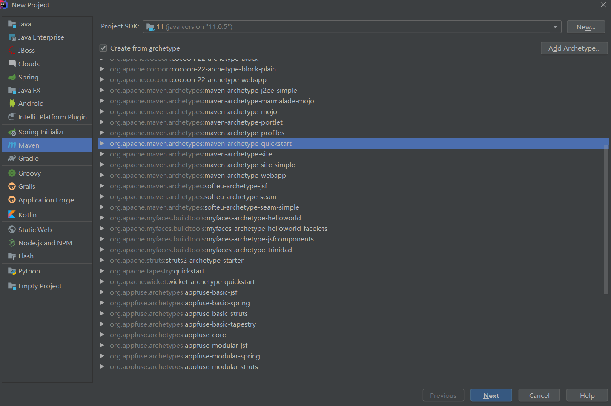
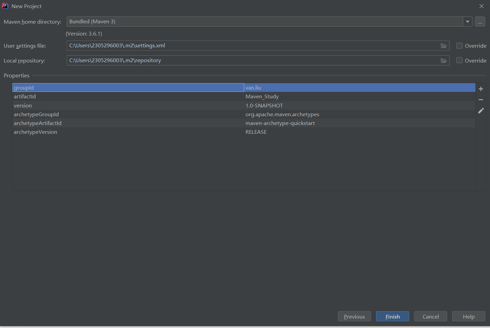
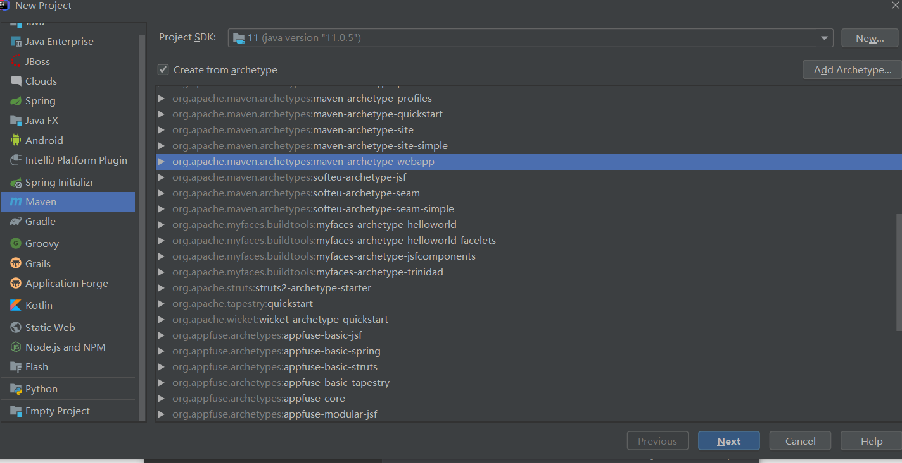
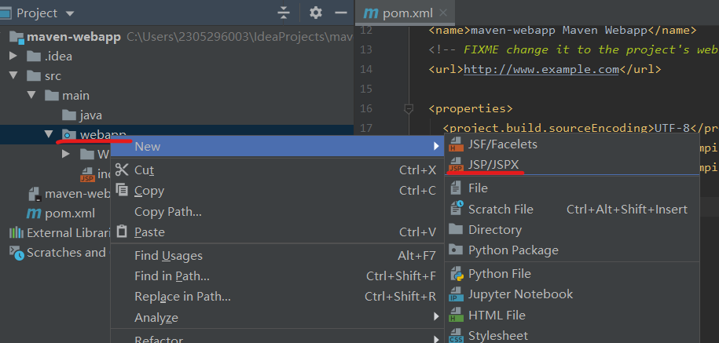
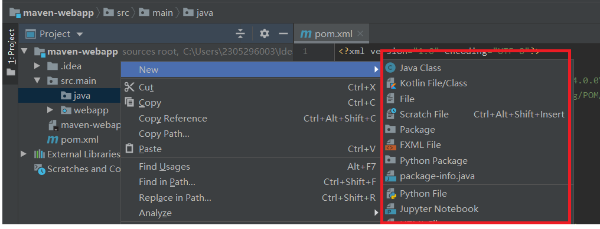
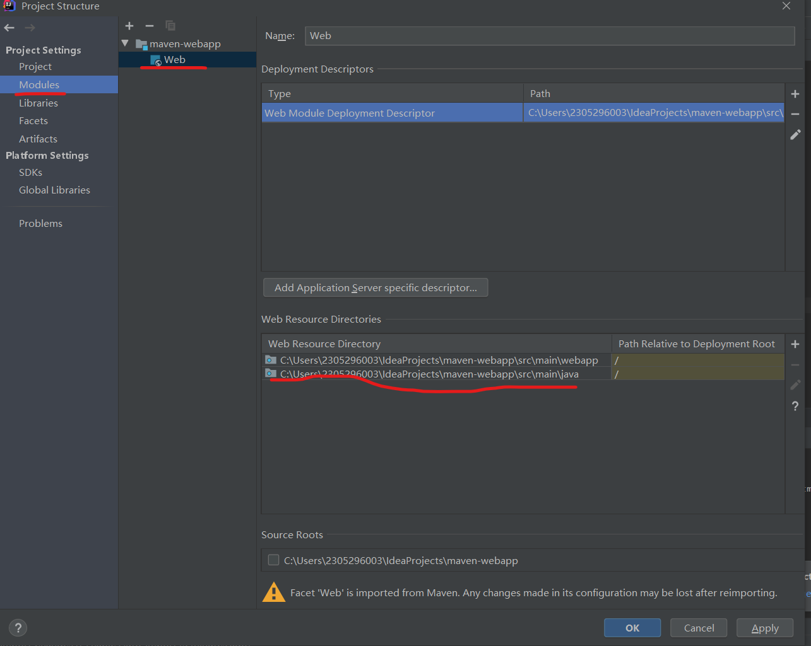
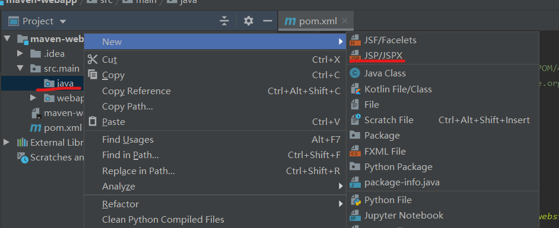

创建maven（如果有本地没有的jar包，需要联网状态）

> 使用骨架

> 创建maven_web

**jsp这类资源一般都放在web资源下面，但是如果想将它放在java包下，在idea中只能将java包设置为资源包**

开始的时候是不能在java包中创建jsp类资源的。

需要将其设置为web Resource Directories，才可以。（不过都不这样写，都是写在webapp中）

像上面这般设置后，就可以在java包中创建web资源了，如下。

