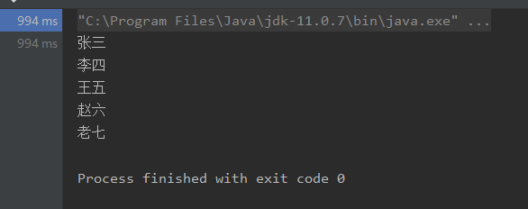

> 需要导入的依赖

1. mysql-connector-java包依赖
2. junit测试包依赖

```xml
<dependencies>
        <dependency>
            <groupId>junit</groupId>
            <artifactId>junit</artifactId>
            <version>4.12</version>
            <scope>test</scope>
        </dependency>

        <dependency>
            <groupId>mysql</groupId>
            <artifactId>mysql-connector-java</artifactId>
            <version>8.0.23</version>     <!--这个版本不能太低，会报错-->
        </dependency>
</dependencies>
```

> domain包的items类

```java
public class Items {
    private String name;
    private int id;

    public String getName() {
        return name;
    }

    public void setName(String name) {
        this.name = name;
    }

    public int getId() {
        return id;
    }

    public void setId(int id) {
        this.id = id;
    }
}
```

>ItemsDao接口

```java
import van.liu.domain.Items;

import java.sql.SQLException;
import java.util.List;

public interface ItemsDao {
    public List<Items> findAll() throws SQLException;
}
```

> ItemsDaoImpl实现类

```java

import van.liu.dao.ItemsDao;
import van.liu.domain.Items;

import java.sql.*;
import java.util.ArrayList;
import java.util.List;

public class ItemsDaoImpl implements ItemsDao {
    public List<Items> findAll() throws SQLException {
        List<Items> list = new ArrayList<Items>();
        Connection connection = null;
        PreparedStatement pst = null;
        ResultSet resultSet = null;
        try {
            //加载驱动类（运行的时候，说加载驱动类是不赞成的，驱动程序通过spi自动注册）
            /*
             Loading class `com.mysql.jdbc.Driver'.
             This is deprecated. The new driver class is `com.mysql.cj.jdbc.Driver'.
             The driver is automatically registered via the SPI and manual loading of the driver class
             is generally unnecessary）
             */
            //Class.forName("com.mysql.jdbc.Driver");
            //要从数据库中获取数据，就需要获取Connection对象
            connection = DriverManager.getConnection("jdbc:mysql://localhost:3306/maven", "root", "liujian");
            //获取真正操作数据库的对象
            pst = connection.prepareCall("select * from items");
            //执行数据库查询
            resultSet = pst.executeQuery();

            //把数据库结果集转换为java的list集合
            while (resultSet.next()) {
                Items items = new Items();
                items.setId(resultSet.getInt("id"));
                items.setName(resultSet.getString("name"));
                list.add(items);
            }
            return list;
        } catch (Exception e) {
            e.printStackTrace();
        } finally {
            connection.close();
            pst.close();
            resultSet.close();
        }
        return null;
    }
}
```

> 测试类

```java
import org.junit.Test;
import van.liu.domain.Items;
import van.liu.impl.ItemsDaoImpl;

import java.sql.SQLException;
import java.util.List;

public class ItemTest {
    @Test
    public void itemTest() throws SQLException {
        ItemsDaoImpl itemsDaoiml = new ItemsDaoImpl();
        List<Items> all = itemsDaoiml.findAll();
        for (Items list: all){
            System.out.println(list);
        }
    }
}
```

运行结果：

 