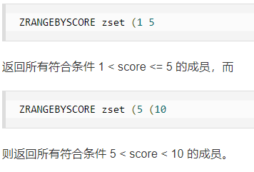

# Zset(有序集合)

在set基础上增加一个值，我们可以根据这个值来进行排序

set：k1 v1

zset：k1 score1 v1          //可以根据score进行排序

```bash
################################################################
#zadd key score member...
127.0.0.1:6379> zadd zset 1 one 2 two 3 three
(integer) 3
127.0.0.1:6379> zrange zset 0 -1   #zrange 显示
1) "one"
2) "two"
3) "three"
################################################################
# zrangebyscore 用来筛选  -inf代表负无穷   +inf代表正无穷
127.0.0.1:6379> zadd salary 10000 kuangsheng
(integer) 1
127.0.0.1:6379> zadd salary 20000 liuying
(integer) 1
127.0.0.1:6379> zadd salary 100000 liujian
(integer) 1
127.0.0.1:6379> zrange salary 0 -1
1) "kuangsheng"
2) "liuying"
3) "liujian"
127.0.0.1:6379> zrangebyscore salary 20000 +inf
1) "liuying"
2) "liujian"
################################################################
# zrevrange 按照score降序排列
127.0.0.1:6379> zrange salary 0 -1 withscores
1) "kuangsheng"
2) "10000"
3) "liuying"
4) "20000"
5) "liujian"
6) "100000"
127.0.0.1:6379> zrevrange salary 0 -1 withscores
1) "liujian"
2) "100000"
3) "liuying"
4) "20000"
5) "kuangsheng"
6) "10000"
################################################################
```

可以用 ( 表示开区间，不写表示的是闭区间




到这里有一个疑问，zset是放进去后，底层就自动排序的吗？于是就有了下面这个测试用例，发现果真如此。

```bash
################################################################
127.0.0.1:6379> zadd money 2 liujian
(integer) 1
127.0.0.1:6379> zadd money 4 liuying 6 zhangsan 3 lisi 5 wangwu
(integer) 4
127.0.0.1:6379> zrange money 0 -1
1) "liujian"
2) "lisi"
3) "liuying"
4) "wangwu"
5) "zhangsan"
127.0.0.1:6379> zrangebyscore (4 6
(error) ERR wrong number of arguments for 'zrangebyscore' command
127.0.0.1:6379> zrangebyscore money (4 6
1) "wangwu"
2) "zhangsan"
################################################################
```

Redis的有序集合Zset，底层的实现有两种，一种是ziplist(压缩链表)，另一种是skiplist(跳表)

==<font color="red">什么时候用ziplist，什么时候用skiplist？</font>==

当zset所保存的元素少于128个，且所有元素大小都小于64字节时，用的是ziplist

不满足上述条件就用skiplist


==<font color="red">ziplist和kiplist都是怎样实现的？</font>==

//待redis学的差不多了再来看这两个底层


```bash
################################################################
# zrem 移除元素
127.0.0.1:6379> zrange money 0 -1 withscores
 1) "liujian"
 2) "2"
 3) "lisi"
 4) "3"
 5) "liuying"
 6) "4"
 7) "wangwu"
 8) "5"
 9) "zhangsan"
10) "6"
127.0.0.1:6379> zrem money lisi
(integer) 1
127.0.0.1:6379> zrange money 0 -1 withscores
1) "liujian"
2) "2"
3) "liuying"
4) "4"
5) "wangwu"
6) "5"
7) "zhangsan"
8) "6"
################################################################
# zcard 显示当前集合个数
127.0.0.1:6379> zrange salary 0 -1
1) "kuangsheng"
2) "liuying"
3) "liujian"
127.0.0.1:6379> zcard salary
(integer) 3
################################################################
# zcard 统计指定区间元素的个数
127.0.0.1:6379> zrange zset 0 -1 withscores
1) "a"
2) "1"
3) "b"
4) "2"
5) "d"
6) "4"
7) "f"
8) "6"
127.0.0.1:6379> zcount zset (2 (6
(integer) 1
127.0.0.1:6379> zcount zset 2 (6
(integer) 2
################################################################
```

可以用于：排序

带权重进行判断，重要的设为1，次要设为2

排行榜的实现