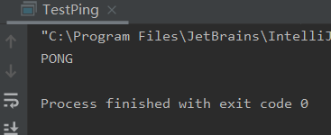

# Jedis

使用Java操作Jedis

使用Java操作redis的中间键

> 测试

1. 导入对应的依赖

```xml
<!--导入jedis的包-->
<dependencies>
    <!-- https://mvnrepository.com/artifact/redis.clients/jedis -->
    <dependency>
        <groupId>redis.clients</groupId>
        <artifactId>jedis</artifactId>
        <version>3.5.1</version>
    </dependency>
    <!--fastjson   -->
    <dependency>
        <groupId>com.alibaba</groupId>
        <artifactId>druid</artifactId>
        <version>1.2.5</version>
    </dependency>

</dependencies>
```


2. 编码测试
   * 连接数据库
   * 操作命令
   * 断开连接

```java
package com.liujian;

import redis.clients.jedis.Jedis;

public class TestPing {
    public static void main(String[] args) {
        //1. new Jedis对象
        Jedis jedis = new Jedis("127.0.0.1", 6379);
        //jedis 所有的命令就是之前学的所有指令
        System.out.println(jedis.ping());
    }
}
```

输出：   

 


//typro使用方法，想让图片居左就在！前面加一个空格


# 事务操作


**pom.xml内容**

```xml
<?xml version="1.0" encoding="UTF-8"?>
<project xmlns="http://maven.apache.org/POM/4.0.0"
         xmlns:xsi="http://www.w3.org/2001/XMLSchema-instance"
         xsi:schemaLocation="http://maven.apache.org/POM/4.0.0 http://maven.apache.org/xsd/maven-4.0.0.xsd">
    <modelVersion>4.0.0</modelVersion>

    <groupId>com.kuang</groupId>
    <artifactId>redis-01-jredis</artifactId>
    <version>1.0-SNAPSHOT</version>

    <!--导入jedis的包-->
    <dependencies>
        <!-- https://mvnrepository.com/artifact/redis.clients/jedis -->
        <dependency>
            <groupId>redis.clients</groupId>
            <artifactId>jedis</artifactId>
            <version>3.5.1</version>
        </dependency>
        <!--fastjson   -->
        <dependency>
            <groupId>com.alibaba</groupId>
            <artifactId>druid</artifactId>
            <version>1.2.5</version>
        </dependency>


        <!-- JSONObject对象依赖的jar包 -->
        <dependency>
            <groupId>commons-beanutils</groupId>
            <artifactId>commons-beanutils</artifactId>
            <version>1.9.3</version>
        </dependency>
        <dependency>
            <groupId>commons-collections</groupId>
            <artifactId>commons-collections</artifactId>
            <version>3.2.1</version>
        </dependency>
        <dependency>
            <groupId>commons-lang</groupId>
            <artifactId>commons-lang</artifactId>
            <version>2.6</version>
        </dependency>
        <dependency>
            <groupId>commons-logging</groupId>
            <artifactId>commons-logging</artifactId>
            <version>1.1.1</version>
        </dependency>
        <dependency>
            <groupId>net.sf.ezmorph</groupId>
            <artifactId>ezmorph</artifactId>
            <version>1.0.6</version>
        </dependency>
        <dependency>
            <groupId>net.sf.json-lib</groupId>
            <artifactId>json-lib</artifactId>
            <version>2.2.3</version>
            <classifier>jdk15</classifier><!-- 指定jdk版本  中央仓库只有13和15这两个版本-->
        </dependency>
        <!-- Json依赖架包下载 -->
    </dependencies>

</project>
```


测试类：

```java
package com.liujian;

import net.sf.json.JSONObject;
import redis.clients.jedis.Jedis;
import redis.clients.jedis.Transaction;

public class TestPing {
    public static void main(String[] args) {
        //1. new Jedis对象
        Jedis jedis = new Jedis("127.0.0.1", 6379);
        JSONObject jsonObject = new JSONObject();
        jsonObject.put("hello","world");
        jsonObject.put("name","liujian");


        //开启事务
        Transaction multi = jedis.multi();
        String result = jsonObject.toJSONString();      //这儿显示没有toJSONObject这个方法
        multi.set("user1",result);
        try {
            multi.set("user1",result);
            multi.set("user2",result);

            multi.exec(); //执行事务一
        } catch (Exception e) {
            multi.discard();
            e.printStackTrace();
        } finally {
            System.out.println(jedis.get("user1"));
            System.out.println(jedis.get("user2"));
            jedis.close(); //关闭连接
        }
    }
}
```


