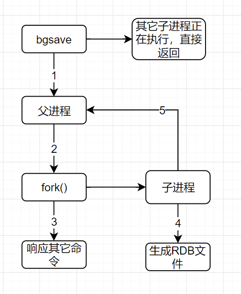

# Redis的持久化

Redis为什么要持久化？

因为Redis是内存数据库，所有的数据都存储在内存中，只要电脑一断电，所有的数据都会丢失，所以需要持久化。

Redis持久化分为两种：

1. RDB持久化
2. AOF持久化

> 优缺点

- RDB文件都是二进制文件，占用内存较少

- RDB主进程处理命令的效率相对于aof而言高些，因为每次来个请求都不会处理任何事情，只有bgsave的时候会fork子进程并且可能copyonwrite。

  而aof每次都是写盘操作，效率自然没有RDB高。

- 每次丢失的时候rdb丢失的会比aof多。因为aof可以每秒持久化一次，而进行bgsave，没有那么灵活。没有aof持久化快。

- RDB适合大规模数据恢复，对数据的完整性要求不高

## RDB持久化

rbd保存的文件名是dump.rdb，以生成快照的方式保存到硬盘

产生rdb文件触发机制：

1. save x y 的规则满足的情况下，会自动触发rdb规则

2. 执行flushall命令也会触发rdb规则
3. 退出redis，也会产生rdb文件

> rdb持久化触发

1. 手动触发：

   save命令和bgsave命令都可以生成rdb文件

   save命令会阻塞Redis服务器进程，直到rdb文件创建完毕为止，在Redis服务器阻塞期间，服务器不能处理任何命令请求

   而bgsave会创建一个子进程，由子进程来创建rdb文件，父进程继续处理请求bgsave命令执行过程中，只有fork子进程时会阻塞服务器。

   而对于save命令，整个过程都会阻塞服务器，因此save已基本被废弃；

2. 自动触发：

   最常见的就是在配置文件中，用save x y来指定x秒内发生y次变化时会触发bgsave。如下：

    

   在主从复制场景下，如果从节点执行全量复制操作，==则主节点会执行bgsave命令==，并将rdb文件发送给从节点

   ==执行shutdown时，自动执行rdb持久化==

   

   

   

   

   > 自动触发save的原理：

   Redis的save x y，是通过serverCron函数、dirty计数器、和lastsave时间戳来实现的。

   ==serverCron  每隔100ms执行一次，其任务有很多，其中之一便是看save x y的条件是否满足，如果满足就执行bgsave==

   ==dirty计数器 记录了上一次执行bgsave/save命令后，服务器状态进行了多少次修改（包括增删改）；当save/bgsave执行完成后，会将dirty重新置为0。==

   ==每一次save x y的条件，当前时间 - lastsave > x 且 dirty >= y==

   save x y 会触发bgsave

   

   > bgsave的执行流程

    

   (1) Redis父进程首先判断：当前是否在执行save，或bgsave/bgrewriteaof的子进程，如果在执行则bgsave命令直接返回。bgsave/bgrewriteaof 的子进程不能同时执行，主要是基于性能方面的考虑：两个并发的子进程同时执行大量的磁盘写操作，可能引起严重的性能问题。
   (2) 父进程执行fork操作创建子进程，这个过程中父进程是阻塞的，Redis不能执行来自客户端的任何命令
   (3) 父进程fork后，bgsave命令返回”Background saving started”信息并不再阻塞父进程，并可以响应其他命令
   (4) 子进程创建RDB文件，根据父进程内存快照生成临时快照文件，完成后对原有文件进行原子替换
   (5) 子进程发送信号给父进程表示完成，父进程更新统计信息

   

   

   > bgsave中有一个fork，说说fork原理

   fork是unix和linux操作系统的一个api，fork用于创建一个子进程。

   fork创造出来的子进程==共享其父类的内存数据==，共享fork出子进程的那一刻的内存数据。之后主进程修改数据对子进程不可见，子进程修改数据对主进程不可见。

   这时候有个问题了，子进程与主进程共享一块内存，它又是怎么互不影响的呢？==这就用到了copyonwrite==

   

   > copyonwrite

   写入时复制

   通俗的来说，fork过后，内核将所有主进程的内存页都设置为read-only，子进程的空间地址指向主进程，主进程后来有修改请求，(子进程不会有修改请求，因为子进程在这里只是rdb持久化)，CPU检测到此时是read-only，于是触发页异常中断（page-fault），陷入内核的一个中断例程。中断例程中，内核就会把触发的异常的页复制一份（这里仅仅复制异常页，也就是所修改的那个数据页，而不是内存中的全部数据）。

   

   总结：copyonwritefork()出来的子进程共享主进程的物理空间，当主子进程有内存写入操作时，read-only内存页发生中断，将触发的异常的内存页复制一份(其余的页还是共享主进程的)。

   

