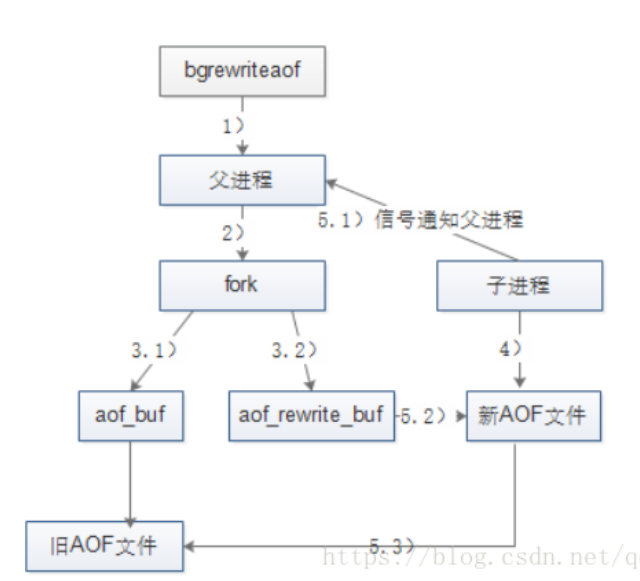
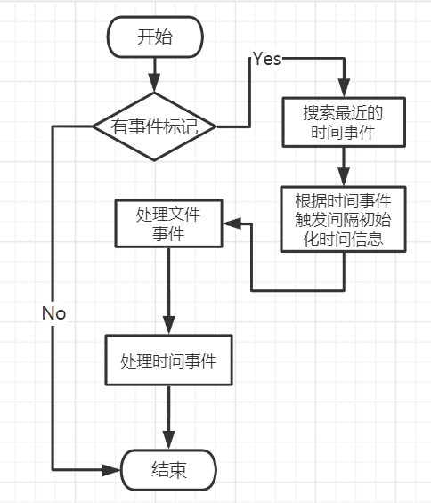

# AOF持久化（AppendOnlyFile）

AOF持久化方式：

​	前面说过RDB持久化的方式是，将数据写入文件(显示出来的都是二进制代码)，而==AOF==持久化是将每次写的命令记录到单独的日志文件中。

​	当Redis重启时，会将AOF文件中的命令从头到尾执行一遍来恢复数据。

​	aof持久化所保存的文件是appendonly.aof

> AOF持久化开启

Redis默认持久化是RDB，若想使用AOF，那么需要修改配置文件。

appendonly no 改为 yes 即开启AOF持久化

appendonly.aof这个文件如果被认为修改，有错误，那么redis连接客户端时是连接不了的。

这时候可以通过redis-check-aof来修复。通过命令redis-check-aof --fix修复（这个修复可能有正确操作也会被删除）

> AOF不需要触发，因为它需要保存每条命令

优点：

- 每次修改都同步
- 每秒同步一次，可能丢失那一秒的数据
- 从不同步，效率高

缺点：

- 相对于数据文件来说，aof远远大于rdb，修复的速度也比rdb慢
- aof运行效率也比rdb慢，所以redis默认配置是rdb

> AOF持久化的实现

1. 命令追加（append）

   当aof持久化处于开启状态，服务器执行完一个写的命令之后，会以协议格式将被执行的写命令，追加到服务器状态的aof_buf缓冲区的末尾

2. 文件写入

   flushAppendOnlyFile函数：

   - ==Redis服务器进程是一个事件循环==，这个循环的作用：循环中==**文件事件**负责接收客户端的请求，以及向客户端发送命令回复==，还有一个**时间事件**负责执行像servercron函数这样需要定时运行的函数。
   - 服务器在处理文件事件时可能会执行写命令，使得一些内容追加到aof_buf缓冲区中，所以服务器每次结束一个事件循环之前，它都会调用flushAppendOnlyFile函数，考虑是否需要将aof_buf缓冲区中的内容写入并保存到AOF文件中。

   appendfsync为配置文件中的一个配置

   - 有三个选项：always、no、everysec
   - always：将aof_buf缓冲区中所有内容==**写入并同步**==到AOF文件
   - everysec：将aof_buf缓冲区中所有内容==**写入**==到AOF文件中，如果上次同步AOF文件的时间距离现在**超过一秒**，那么再次对AOF文件进行**同步**，并且这个同步操作是由一个线程专门负责执行的。
   - no：将aof_buf缓冲区的所有内容**写入**到AOF文件，但并**不对AOF文件进行同步**，什么时候**同步由操作系统决定**。

3. 文件重写

   随着Redis服务器执行的命令越来越多，AOF文件也会越来越大；便影响服务器的正常运行，也会导致数据恢复需要更长的时间，于是文件重写诞生了。

   - 文件重写，指的是定期重写AOF文件，减小AOF文件体积（重写是将Redis进程中的数据转化为写命令，**与原aof文件没有一点关系**）
   - 文件重写与原aof文件没有关系！

   文件重写为什么能够压缩AOF文件？

   1. 过期的数据不会写入aof文件
   2. 无效命令不会写入文件，比如删除操作
   3. 多条命令可以合而为一，比如将一个key连续修改两次，这里只需要记录最后一次的修改。

   文件重写的触发

   - 分为手动触发和自动触发

   1. 手动触发

      调用bgrewriteaof命令

   2. 自动触发

      自动触发需要满足配置文件中的两个配置参数

      auto-aof-rewrite-min-size：执行AOF重写时，文件的最小体积，默认值为64MB。
      auto-aof-rewrite-percentage：执行AOF重写时，当前AOF大小(即aof_current_size)和上一次重写时AOF大小(aof_base_size)的比值。

      当上面两个参数都满足时才会触发。即bgrewriteaof操作

 

==aof_rewrite_buf：重写缓冲区==

1) Redis父进程首先判断当前是否存在正在执行 bgsave/bgrewriteaof的子进程，如果存在则bgrewriteaof命令直接返回，如果存在bgsave命令则等bgsave执行完成后再执行。
2) 父进程执行fork操作创建子进程（这个过程中父进程是阻塞的）
3.1) 父进程fork后，bgrewriteaof命令返回”Background append only file rewrite started”信息并不再阻塞父进程，并可以响应其他命令。Redis的所有写命令依然写入AOF缓冲区，并根据appendfsync策略同步到硬盘，保证原有AOF机制的正确。
3.2) 由于fork操作使用写时复制技术，子进程只能共享fork操作时的内存数据。由于父进程依然在响应命令，因此Redis使用AOF重写缓冲区(图中的aof_rewrite_buf)保存这部分数据，防止新AOF文件生成期间丢失这部分数据。也就是说，bgrewriteaof执行期间，Redis的写命令同时追加到aof_buf和aof_rewirte_buf两个缓冲区。
4)==子进程根据内存快照，按照命令合并规则写入到新的AOF文件。== 
5.1) 子进程写完新的AOF文件后，向父进程发信号，父进程更新统计信息。
5.2) 父进程把AOF重写缓冲区的数据写入到新的AOF文件，这样就保证了新AOF文件所保存的数据库状态和服务器当前状态一致。
5.3) 使用新的AOF文件替换老文件，完成AOF重写。

​		

> 上面提到了Redis服务器进程是一个事件循环

这个事件循环是什么？

事件循环中有一些操作，其中包括文件事件，和时间事件        ==//这两个事件暂时没整理，看了觉得等于没看==

事件循环流程图：

 

这个循环决定了Redis响应各种请求的速度。

