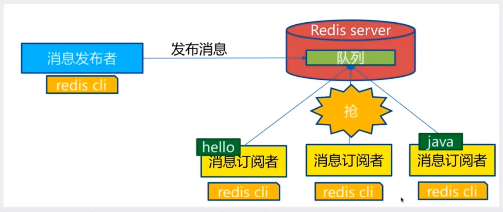
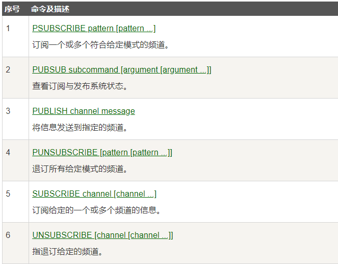

# Redis 发布订阅（用的不多，基本没人用）

涉及三者：

消息发布者

频道(队列)

消息订阅者




## Redis发布订阅命令：

 


订阅端：

```bash
127.0.0.1:6379> SUBSCRIBE haizeiwang  # 订阅一个频道
Reading messages... (press Ctrl-C to quit)
1) "subscribe"
2) "haizeiwang"
3) (integer) 1
# 等待读取推送信息
1) "message"
2) "haizeiwang"
3) "first"
1) "message"
2) "haizeiwang"
3) "second"
```


发布端：

```bash
127.0.0.1:6379> publish haizeiwang first  #发布消息到频道
(integer) 1
127.0.0.1:6379> PUBLISH haizeiwang second
(integer) 1
127.0.0.1:6379>
```


