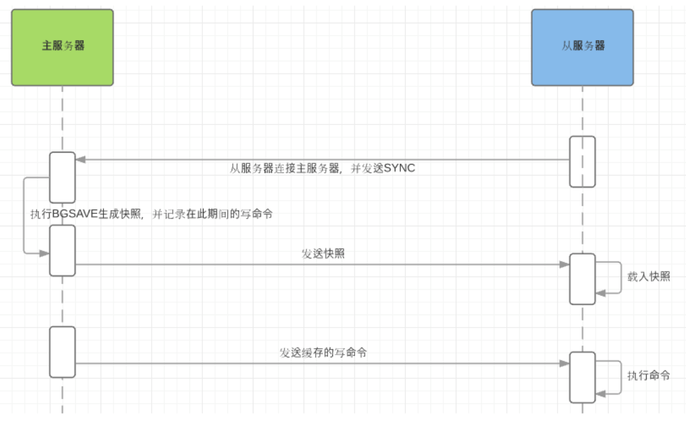
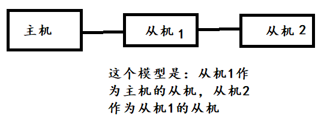

# 主从复制

1. 来源：当redis 服务重启后会，将硬盘上持久化的数据恢复到内存中。但是当 redis 服务器的硬盘损坏了可能会导致数据丢失。如果通过 redis 的主从复制机制就可以避免这种单点故障

2. 作用：
   - 数据冗余：主从复制实现了数据的热备份，是持久化之外的一种数据冗余方式。
   - 故障恢复：当主节点出现问题时，可以由从节点提供服务。
   - 负载均衡：在主从复制的基础上，配合读写分离，可以由主节点提供写服务，由从节点提供读服务。
   - 高可用基石：主从复制是哨兵和集群能够实施的基础。


## 一主二从

默认情况下，每台Redis服务器都是主节点；一般情况下只用配置从机就好了

可以通过info replication查看信息。

认主机是slaveof命令，比如：slaveof 127.0.0.1 6379  当前从机认6379端口这个为主机

永久生效的修改是在配置文件中修改，如果有密码还需要在下面的配置中录入密码

```bash
replicaof <masterid> <masterport>
```


> 全量复制

全量复制发生在从机初始化阶段，从机需要将主机的所有数据都复制一份。

- 从机连接主机，`发送SYNC命令`； 
- 主机接收到SYNC命名后，开始执行==BGSAVE==命令生成==RDB文件==并使用缓冲区记录此后执行的所有写命令； 
- 主机BGSAVE执行完后，向所有从机发送快照文件，并在发送期间继续记录被执行的写命令；
- 从机收到快照文件后丢弃所有旧数据，载入收到的快照；
- 主机快照发送完毕后开始向从机发送缓冲区中的写命令；
- 从机完成对快照的载入，开始接收命令请求，并执行来自主机缓冲区的写命令；

这样从机就完成了初始化。

下面这个图很形象：




> 增量复制

Redis增量复制是指从机正常工作时主服务器发生的写操作同步到从机的过程。 
增量复制的过程主要是主机每执行一个写命令就会向从机发送相同的写命令，从机接收并执行收到的写命令。

当我们在主机增减数据的时候，就会触发 replicationFeedSalves()函数，接下来在主机上调用的每一个命令都会使用replicationFeedSlaves() 函数来同步到Slave服务器。在执行此函数之前主机会判断用户执行的命令是否有数据更新，如果有数据更新并且slave 服务器不为空，才会执行此函数。此函数主要的工作就是把用户执行的命令发送到所有的 slave服务器，让 slave 服务器执行，这样就是实施同步功能了。


> 也可以主机从机一层一层的连着，如下：(不过这种的没人用)

 

如果主机宕机了，那么从机1可以手动变为主机：==slaveof no one==命令执行后，从机1就变为主机了。那么其它从机就可以手动认从机1作为主机。

如果原来的主机恢复了，只能将原来的主机作为新主机的从机了。


>细节点

主机可以写，从机不能写只能读！主机所有的信息和数据都自动被从机保存！

全量复制

增量复制

只要重新连接到主机，就会执行一次全量复制