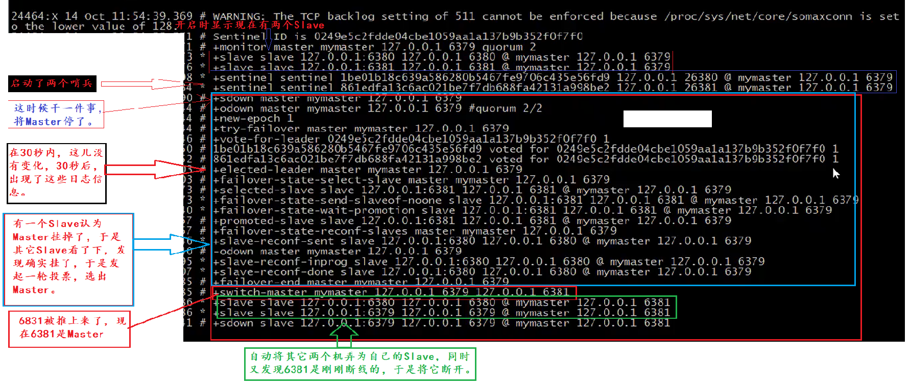

# 哨兵模式

（自动选取老大）

实现故障自动转移

> 配置哨兵

启动哨兵：redis-sentinel sentinel-端口号.conf

哨兵的配置文件：sentinel.conf

```bash
port 26379
dir /tmp  #工作信息存储在哪里
monitor mymaster 127.0.0.1 6379 3  #最后一个参数3表示，如果有三个Slave认为主机挂了，那么就认为主机挂了。
down-after-milliseconds mymaster 30000  # 30秒内连接主机多长时间没反应，认为主机挂了
parallel-syncs mymaster 1 # 当主机挂了，新的上任，当新的上任时有多少个卡尔同步。
failover-timeout mymaster 180000 # 同步中多长时间同步完成算有效，超过多长时间就算超时。
```

哨兵的日志：




构架原理：

1. 多个sentinel发现并确认master有问题
2. sentinel内部选出master
3. 通知其它slave成为新master的slave
4. 通知客户端主从变化
5. 如果老的master开启了，会成为新master的slave

要实现上述功能，主要细节：

1. 每10秒，哨兵会向master和slave发送INFO命令（为了监控每一个节点的细节）
2. 每2秒，哨兵会向master库和slave频道发送自己信息
3. 每1秒，哨兵会向master和slave以及其它哨兵节点发送ping命令（主要看当前master是否挂了）


> 故障转移阶段

sentinel1向master发送请求，master没回，sentinel1不停的发，过了一定时间，master还是没有回复，sentinel1会认为master挂了，并标记master为SRI_S_DOWN，sentinel1这时候会向其它sentinel发送master挂了的消息，其它的sentinel这时候会去master那确认，如果大都说master挂了（这里有参数，至少有多少人认为master挂了），那么master就真挂了，被标记为SRI_O_DOWN。

标记为SRI_S_DOWN称为主观下线，有一个sentinel认为master挂了

标记为SRI_O_DOWN称为客观下线，多个sentinel认为master挂了

==master被认为是客观下线后就开始故障转移了。==

故障转移是由一个sentinel节点来完成的，这个sentinel也是需要选举出来，机制同选举新master差不多。

1. master客观下线后，会有选票机制，选出新master。

2. 哨兵发送指令
   1. 向新的master发送slave of no one  （这个命令让从机关闭复制功能，并从从机变为主机）
   2. 向其它的slave发送新masterIp端口（让他们成为新master 节点的 slave 节点）
   3. 更新原来master节点配置为slave节点，并保持对其进行关注，一旦这个节点重新恢复正常后,会命令它去复制新的master节点信息

```bash
+switch-master: 表示切换主节点(从节点晋升为主节点)
+sdown:主观下线
+odown:客观下线
+convert-to-slave:切换从节点(原主节点降为从节点)
```

