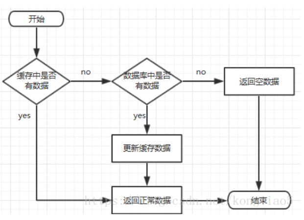
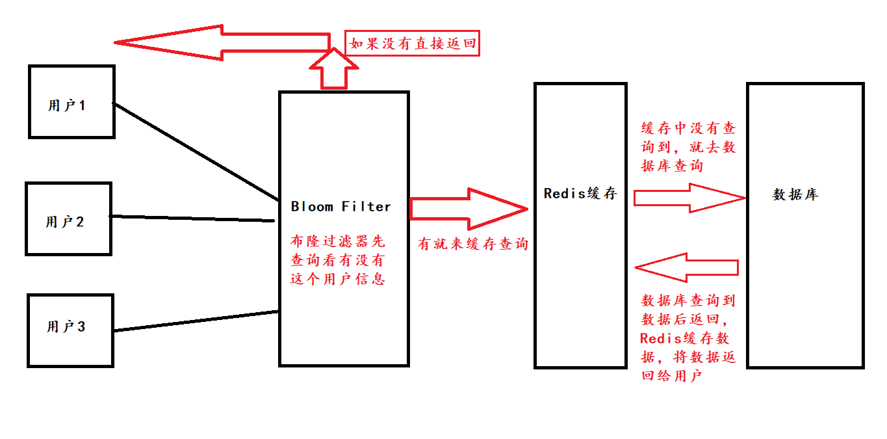
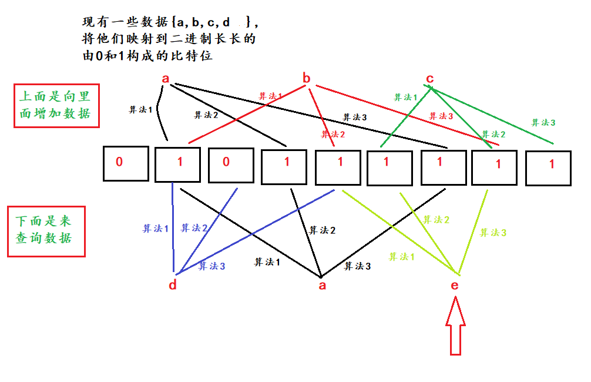

# 缓存穿透

> 概念引入

用户想要查询一个数据，发现Redis内存数据库没有，即缓存没有命中，于是向持久层数据库查询。发现也没有，查询失败。如果有人不断的用不存在的key攻击我们应用，这是个问题。

缓存处理流程图：

 

## 缓存穿透

> 概念

缓存穿透是指缓存和数据库中都没有的数据，而用户不断发起请求，如发起为id为“-1”的数据或id为特别大不存在的数据。这时的用户很可能是攻击者，攻击会导致数据库压力过大。

> 缓存穿透解决方案

有两种

1. 加一层filter过滤，比如id<=0的拦截，等等。
2. 将缓存中取不到并且数据库中也没有取到的数据设为key-null，这时候如果用特多的不存在的key来请求，会导致数据库崩溃。可以将其设个过期值。

**布隆过滤器**（Bloom Filter）

用于检索一个元素是否在这个集合中。

 空间效率和查询时间都远远超过一般算法，缺点是有一定的==误识别率==，和==删除困难==。

布隆过滤器判断这个元素在不在，==如果说不在，那一定是不在==，如果说在，有一定的概率在数据库中是不在的。

布隆流程图：

> 布隆过滤器的算法

通过二进制向量和一些随机映射函数

向其中增加数据的时候，可以有多个算法，被映射到的位置赋值为1，其它默认都是0。

查询数据的时候，可以看见==e==在布隆过滤器中是没有的，但是它还是被查询出来的结果是存在，这就是布隆的误识别。

