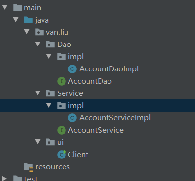

# Spring

> 概念：Spring是什么？

Spring是一个轻量级Java开发框架

**网上看了都是千篇一律的，像下面这样，不看还好看了之后更蒙：**

1. Spring的核心是一个轻量级（Lightweight）的容器（Container）。
2. Spring是实现IoC（Inversion of Control）容器和非入侵性（No intrusive）的框架。
3. Spring提供AOP（Aspect-oriented programming）概念的实现方式。
4. Spring提供对持久层（Persistence）、事物（Transcation）的支持。
5. Spring供MVC Web框架的实现，并对一些常用的企业服务API（Application Interface）提供一致的模型封装。
6. Spring提供了对现存的各种框架（Structs、JSF、Hibernate、Ibatis、Webwork等）相整合的方案。

**看一下例子**：

1. 使用idea创建一个web项目
2. 创建servlet，servlet中写业务代码，组装需要数据，将数据以json格式输出
3. 在web.xml中配置servlet信息
4. 将项目部署到tomcat中

这是我们web开发过程的基本步骤，不过现在有了Spring，就不用将项目部署到tomcat，不用写web.xml配置文件，不用将数据以json格式返回。Springboot都帮我们实现了。


> Spring的优势

降低程序间的耦合性

**实际开发时，做到编译期不依赖，运行时才依赖**

程序的耦合：

​	耦合：程序间的依赖关系：类之间的依赖，方法之间的依赖

我们需要减少程序的耦合性

**解耦的方法：**

1. **使用反射来创建对象，而避免使用new关键字**
2. **通过读取配置文件来获取要创建的对象的全类名** （这儿可以防止类名写死了，然后调用不了）

> 需要一个配置文件，配置service和dao

配置文件的内容：全限定类名，唯一标识（key,value）

再通过读取配置文件的类容，来反射调用方法。


//idea Shift+enter实现光标换行

> 传统的业务逻辑：

代码：

 

> Service接口：AccountService

```java
public interface AccountService {
    public void save();
}
```

> Service的一个实现类：AccountServiceImpl

```java
public class AccountServiceImpl implements AccountService {
    AccountDao dao = new AccountDaoImpl();
    public void save() {
        dao.save();
    }
}
```

> Dao接口：AccountDao

```java
public interface AccountDao {
    public void save();
}
```

> Dao的实现类：AccountDaoImpl

```java
public class AccountDaoImpl implements AccountDao {

    /**
     * 模拟保存
     */
    public void save() {
        System.out.println("保存了account");
    }
}
```

> 测试类相当于Servlet：Client

```java
public class Client {
    public static void main(String[] args) {
        AccountService service = new AccountServiceImpl();
        service.save();
    }
}
```


> 看一下耦合度：

Service的实现类中有new关键字

测试类中有new关键字

**怎样解决这种依赖？**

给出的方法是使用工厂模式

# 使用工厂后的代码：

 

先写个配置文件：bean.properties

```properties
accountService=van.liu.Service.impl.AccountServiceImpl
accountDao=van.liu.Dao.impl.AccountDaoImpl
```

Service层都没有变化，只是将Dao的实现类改变了，同时测试类(Servlet)也变了

> AccountServiceImpl实现类

```java
public class AccountServiceImpl implements AccountService {
    //AccountDao dao = new AccountDaoImpl();
    AccountDao dao = (AccountDao) BeanFactory.getBean("accountDao");
    public void save() {
        dao.save();
    }
}
```


> 再新建一个包factory，新建一个BeanFactory类

```java
/**
 * 一个创建Bean对象的工厂
 * Bean：可重用的组件
 * JavaBean：用Java编写的可重用组件
 *
 * 需要一个配置文件来存放service和dao的全类名称（用properties或者xml都可以）
 * 通过读取配置文件中的内容，反射创建对象
 */
public class BeanFactory {
    //定义一个Properties对象
    private static Properties prop;

    //使用静态代码块为Properties赋值
    static {
        //实例化
        prop = new Properties();
        //
        InputStream in = BeanFactory.class.getClassLoader().getResourceAsStream("bean.properties");
        try {
            prop.load(in);
        } catch (IOException e) {
            throw new ExceptionInInitializerError("初始化properties失败");
        }
    }

    /**
     * 根据Bean的名称获取Bean的对象
     * @return
     */
    public static Object getBean(String beanName) {
        Object bean = null;
        String beanPath = prop.getProperty(beanName);
        try {
            bean = Class.forName(beanPath).newInstance();
        } catch (Exception e) {
            e.printStackTrace();
        }
        return bean;
    }
}
```

> Client类（相当于Servlet）

```java
public class Client {
    public static void main(String[] args) {
        //AccountService service = new AccountServiceImpl();
        AccountService service = (AccountService) BeanFactory.getBean("accountService");
        service.save();
    }
}
```


# 其实这时候还没有结束

> BeanFactory类中的getBean方法：

```java
public static Object getBean(String beanName) {
        Object bean = null;
        String beanPath = prop.getProperty(beanName);
        try {
            bean = Class.forName(beanPath).newInstance();
        } catch (Exception e) {
            e.printStackTrace();
        }
        return bean;
}
```

每次进来都会创建一个实例：bean = Class.forName(beanPath).newInstance();

显然这是多例对象，多例对象，对象被创建多次，效率肯定没有单例高。

而业务逻辑中一般都是单例的（单例对象有线程问题，但是service和dao中不存在线程问题，每次都将数据保存在方法中）

所以我们改用单例对象：只newInstance一次


> 修改为单例对象过后的BeanFactory类:

同时让AccountServiceImpl实现BeanFactoryPostProcessor接口：

```java
public interface BeanFactoryPostProcessor {
    void process();
}
```

添加process()方法：添加的目的是防止BeanFactory静态代码块调用AccountServiceImpl的时候空指针异常

```java
public class AccountServiceImpl implements IAccountService, BeanFactoryPostProcessor {
    private IAccountDao accountDao;
    public AccountServiceImpl(){

    }
    public void saveAccount() {
        int i = 1;
        accountDao.saveAccount();
        System.out.println(i);
        i++;
    }

    @Override
    public void process() {
        this.accountDao = (IAccountDao) BeanFactory.getBean("accountDao");
    }
}
```


BeanFactory类：

```java
/**
 * 一个创建Bean对象的工厂
 * Bean：可重用的组件
 * JavaBean：用Java编写的可重用组件
 *
 * 需要一个配置文件来存放service和dao的全类名称（用properties或者xml都可以）
 * 通过读取配置文件中的内容，反射创建对象
 */
public class BeanFactory {
    //定义一个Properties对象
    private static Properties props;

    //定义一个Map，用于存放我们要创建的对象，将之称为容器。
    private static Map<String,Object> beans;

    //使用静态代码块为Properties赋值
    static {
        try {
            //实例化
            props = new Properties();
            InputStream in = BeanFactory.class.getClassLoader().getResourceAsStream("bean.properties");
            props.load(in);
            //实例化容器
            beans = new HashMap<String, Object>();
            //取出配置文件中所有的key
            Enumeration keys = props.keys();
            //遍历枚举
            while (keys.hasMoreElements()) {
                String key = keys.nextElement().toString();
                String beanPath = props.getProperty(key);

                //反射创建对象E   // 循环依赖
                Object value = Class.forName(beanPath).newInstance();
                beans.put(key,value);
            }

            beans.forEach((key, value) -> {
                if(value instanceof BeanFactoryPostProcessor){
                    System.out.println(value);
                    ((BeanFactoryPostProcessor) value).process();
                }
            });

        } catch (Exception e) {
            throw new ExceptionInInitializerError("初始化properties失败");
        }
    }
    /**
     * 根据Bean的名称获取Bean的对象
     * @return
     */
    public static Object getBean(String beanName) {
        return beans.get(beanName);
        
    }
}
```


