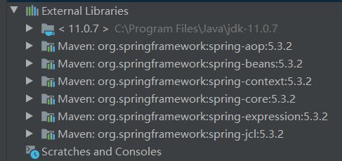
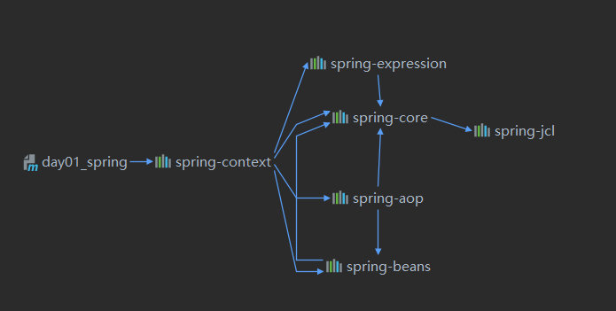
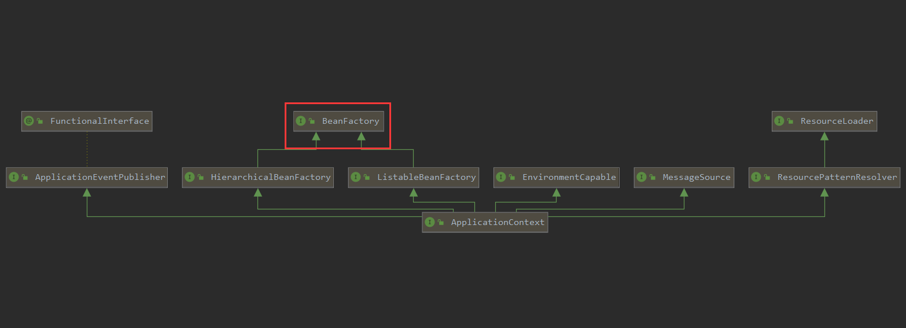
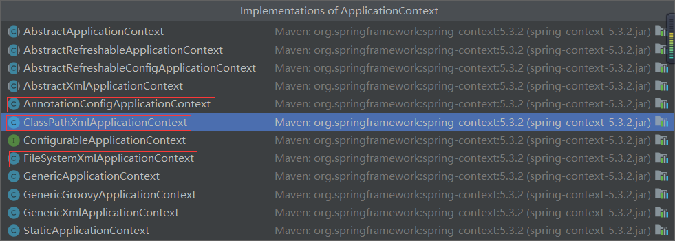

# IOC

## 基于xml的spring开发环境

> 创建一个maven工程导入依赖

```bash
<dependency>
    <groupId>org.springframework</groupId>
    <artifactId>spring-context</artifactId>
    <version>5.3.2</version>
</dependency>
```


 

> 依赖关系

 


> 基本步骤

1. 导入依赖
2. 编写xml配置文件
3. 获取核心容器对象
4. 根据id获取bean对象

> xml配置文件

```xml
<?xml version = "1.0" encoding="UTF-8"?>
<beans xmlns="http://www.springframework.org/schema/beans"
       xmlns:xsi="http://www.w3.org/2001/XMLSchema-instance"
       xsi:schemaLocation="http://www.springframework.org/schema/beans
        http://www.springframework.org/schema/beans/spring-beans.xsd">
<!--把对象的创建交给spring来管理-->
<bean id = "accountService" class="van.liu.service.impl.AccountServiceImpl"></bean>
<bean id="accountDao" class="van.liu.dao.impl.AccountDaoImpl"></bean>

</beans>
```


`ApplicationContext是什么？`

是一个接口，用于维护bean定义，和对象间的协作关系。

是用于读取bean对象，管理bean的加载，通过getBean方法获取对象


> ApplicationContext依赖关系，顶级父类BeanFactory是功能最小的。

 


> ApplicationContext的实现类


 

常用的三个实现类：

* AnnotationConfigApplicationContext 用于读取注解创建配置文件
* ClassPathXmlApplicationContext 加载类路径下的配置文件（配置文件必须在类路径下）
* FileSystemXmlApplicationContext 加载磁盘任意路径下的配置文件（必须有访问权限）


> 核心容器的两个接口

1. ApplicationContext：采用立即加载方式，读取完配置文件，对象立马创建（单例对象适用）
2. BeanFactory：采用延迟加载方式，什么时候根据id获取对象，什么时候就创建对象（多例对象适用）


> spring对bean的管理

1. 创建bean的三种方式

   - 使用默认构造函数创建

     - 在spring的配置文件中用id和class属性，没有其它属性和标签，采用的就是默认构造函数创建bean对象，如果没有默认构造方法，对象就无法创建
     - 例如：`<bean id = "accountService" class="van.liu.service.impl.AccountServiceImpl"></bean>`

   - 某个类的某个方法的返回值是我们想要的对象

     - 先获取这个类的对象，再通过获取到的类对象去调用那个方法，也就是写两个bean

     - 例如：先获取client对象，再通过client对象调用getBean方法获取返回值，这里的getBean不是static修饰

       ```xml
       <bean id="client" class="van.liu.ui.Client"></bean>
       <bean id="accountService" factory-bean="client" factory-method="getBean"></bean>
       ```

   - 使用某个类中的静态方法获取返回值

     - 如果这个类中的方法是静态的，可以这样写，这里的getBean是static修饰

     - ```xml
       <bean id="accountService" class="van.liu.ui.Client" factory-method="getBean"></bean>
       ```

2. bean对象的作用范围

   bean标签的scope属性，用于指定bean的作用范围

   取值：

   - singleton（单例的，默认）
   - prototype（多例的）
   - request（作用于web应用的请求范围）
   - session（作用于web应用的会话范围）
   - global-session（作用于集群环境的会话范围，当不是集群环境时，它就是session）

3. bean对象的生命周期

   1. 单例对象

      出生：当容器创建时出生

      活着：当容器一直在，对象一直活着

      死亡：容器消亡，对象死亡

      ```java
      public class AccountServiceImpl implements IAccountService {
          
          public void saveAccount() {
              System.out.println("保存了。。。");
          }
      
          public void init() {
              System.out.println("init。。。");
      
          }
          public void destroy() {
              System.out.println("destroy。。。");
          }
      }
      ```

      

      `当对象创建时会执行init-method里的方法，当对象销毁时，会执行destroy-method里的方法`

      ```xml
      <bean id="accountService" class="van.liu.service.impl.AccountServiceImpl" scope="singleton" init-method="init" destroy-method="destroy"></bean>
      ```

      

   2. 多例对象

      出生：当使用对象时创建

      活着：对象在使用过程中一直活着

      死亡：由Java垃圾回收机制回收


