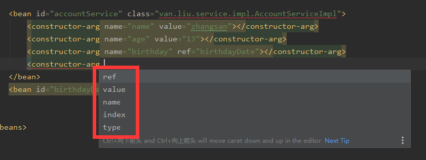
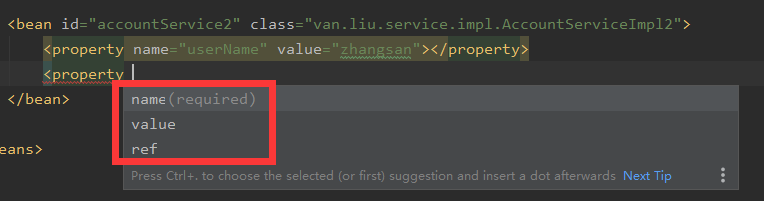
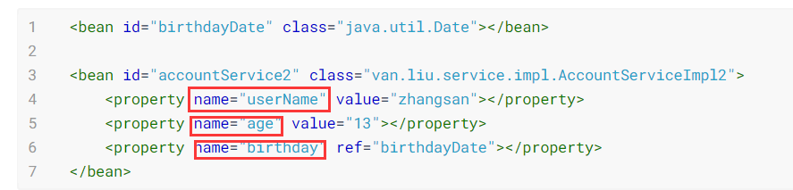

# 依赖注入

> 可以注入的类型

 1. 基本类型和String

 2. bean类型

 3. 复杂类型或集合类型

    ```java
    public class AccountServiceImpl3 implements IAccountService {
        private String[] arrays;
        private List<String> list;
        private Set<String> set;
        private Map<String,String> map;
        private Properties properties;
    
    
        public void saveAccount() {
            System.out.println(Arrays.toString(arrays));
            System.out.println(list);
            System.out.println(set);
            System.out.println(map);
            System.out.println(properties);
        }
    
        public void setArrays(String[] arrays) {
            this.arrays = arrays;
        }
    
        public void setMap(Map<String, String> map) {
            this.map = map;
        }
    
        public void setList(List<String> list) {
            this.list = list;
        }
    
        public void setSet(Set<String> set) {
            this.set = set;
        }
    
        public void setProperties(Properties properties) {
            this.properties = properties;
        }
    }
    ```

    ```xml
    <bean id="accountService3" class="van.liu.service.impl.AccountServiceImpl3">
        <!--数组-->
        <property name="arrays">
            <array>
                <value>AAA</value>
                <value>BBB</value>
                <value>CCC</value>
            </array>
        </property>
    
        <!--列表-->
        <property name="list">
            <list>
                <value>AAA</value>
                <value>BBB</value>
                <value>CCC</value>
            </list>
        </property>
    
        <!--set集合-->
        <property name="set">
            <set>
                <value>AAA</value>
                <value>BBB</value>
                <value>CCC</value>
            </set>
        </property>
    
        <!--map集合-->
        <property name="map">
            <map>
                <entry key="A">
                    <value>a</value>
                </entry>
                <entry key="B">
                    <value>b</value>
                </entry>
                <entry key="C">
                    <value>c</value>
                </entry>
            </map>
        </property>
    
        <!--prop集合-->
        <property name="properties">
            <props>
                <prop key="A">a</prop>
                <prop key="B">b</prop>
                <prop key="C">c</prop>
            </props>
        </property>
    </bean>
    ```

    上面的xml文件其实可以变换成下面这样，可以看出数组里面放list，list里面放数组，map里放prop等等。

    先说明原因：

    可以用于给list结构集合注入的标签：list，array，set

    可以用于给map结构注入的标签：map，props

    总结：结构相同，标签可以互换

    ```xml
    <bean id="accountService3" class="van.liu.service.impl.AccountServiceImpl3">
        <property name="arrays">
            <list>
                <value>AAA</value>
                <value>BBB</value>
                <value>CCC</value>
            </list>
        </property>
    
        <property name="list">
            <array>
                <value>AAA</value>
                <value>BBB</value>
                <value>CCC</value>
            </array>
    
        </property>
    
        <property name="set">
            <list>
                <value>AAA</value>
                <value>BBB</value>
                <value>CCC</value>
            </list>
        </property>
    
        <property name="map">
            <props>
                <prop key="A">a</prop>
                <prop key="B">b</prop>
                <prop key="C">c</prop>
            </props>
        </property>
    
        <property name="properties">
            <map>
                <entry key="A" value="a"></entry>
                <entry key="B">
                    <value>b</value>
                </entry>
                <entry key="C">
                    <value>c</value>
                </entry>
            </map>
        </property>
    </bean>
    ```

    

> 注入的方式：

 1. 使用构造函数注入

    ```java
    public class AccountServiceImpl implements IAccountService {
    
        private String name;
        private Integer age;
        private Date birthday;
    
        public AccountServiceImpl(String name, Integer age, Date birthday) {
            this.name = name;
            this.age = age;
            this.birthday = birthday;
        }
    
        public void saveAccount() {
            System.out.println("保存了。。。");
            System.out.println("name="+name+" age="+age+" birthday="+birthday);
        }
    }
    ```

    几个变量：

     

    type：要注入的数据的数据类型

    index：将要给构造函数中某个索引的位置注入值，索引从0开始

    name：用于给构造函数中指定参数的名称赋值（最常用）

    value：将要传的值

    ref：引用其他的bean类型。在spring的IOC核心容器中出现过的bean对象。

    ```xml
    <bean id="accountService" class="van.liu.service.impl.AccountServiceImpl">
        <constructor-arg name="name" value="zhangsan"></constructor-arg>
        <constructor-arg name="age" value="13"></constructor-arg>
        <constructor-arg name="birthday" ref="birthdayDate"></constructor-arg>
    </bean>
    <bean id="birthdayDate" class="java.util.Date"></bean>
    ```

    使用构造函数注入的弊端：每次都必须将构造函数中的数据全部注入，否则报错

 2. 使用set方法注入

    三个参数（用法同上）

     

    ```java
    public class AccountServiceImpl2 implements IAccountService {
    
        private String name;
        private Integer age;
        private Date birthday;
    
        public void saveAccount() {
            System.out.println("保存了。。。");
            System.out.println("name=" + name + " age=" + age + " birthday=" + birthday);
        }
    
        public void setUserName(String name) {
            this.name = name;
        }
    
        public void setAge(Integer age) {
            this.age = age;
        }
    
        public void setBirthday(Date birthday) {
            this.birthday = birthday;
        }
    }
    ```

    ```xml
    <bean id="birthdayDate" class="java.util.Date"></bean>
    
    <bean id="accountService2" class="van.liu.service.impl.AccountServiceImpl2">
        <property name="userName" value="zhangsan"></property>
        <property name="age" value="13"></property>
        <property name="birthday" ref="birthdayDate"></property>
    </bean>
    ```

     

    `==name属性的这些值是set方法的名称去掉set，并将第一个字母小写得来的。==`

3. 使用注解方式


# 基于注解的IOC

1. 创建对象：

   @component注解

   在类名上面添加注解

   ```java
   /**
    * 注解Component作用是将当前类对象存入spring容器中
    * 如果value没有赋值，默认value为类名首字母小写加后面的部分
    * value即为bean的id
    */
   @Component(value = "accountService")
   public class AccountServiceImpl implements IAccountService {
       public void saveAccount() {
           System.out.println("保存了。。。");
       }
   }
   ```

   ```xml
   <?xml version = "1.0" encoding="UTF-8"?>
   <beans xmlns="http://www.springframework.org/schema/beans"
          xmlns:xsi="http://www.w3.org/2001/XMLSchema-instance"
          xmlns:context="http://www.springframework.org/schema/context"
          xsi:schemaLocation="http://www.springframework.org/schema/beans
           http://www.springframework.org/schema/beans/spring-beans.xsd
           http://www.springframework.org/schema/context
           http://www.springframework.org/schema/context/spring-context.xsd">
       <!--告知spring需要扫描的包有哪些,找到带有注解的，并将带有注解的创建一个实例加到spring容器中-->
       <context:component-scan base-package="van.liu"></context:component-scan>
       
   </beans>
   ```

   其它三个注解：（功能和component基本上差不多，只是为了好区分各个层）

   - Controller：一般用于表现层（Servlet）
   - Service：一般用于业务层（Service）
   - Repository：一般用于持久层（Dao）


注入数据：

​	Autowired：

- 自动按照类型注入，只要容器中有唯一的一个bean对象的类型和要注入的数据类型相同，就可以注入

- 出现位置，可以是变量上，可以是方法上

- 如果没有与之相对应的类型，就报错

- 如果有多个相对应的类型，会先找到符合的类型，再在符合的类型里面找bean的key值和本身变量相同的，如果相同就是此相同的，如果没有相同的就会报错

  举例：

  Service类

  ```java
  @Component(value = "accountService")
  public class AccountServiceImpl implements IAccountService {
      @Autowired
      private IAccountDao accountDao4;
      public void saveAccount() {
          accountDao4.saveAccount();
      }
  }
  ```

  第一个Dao类

  ```java
  @Component("accountDao")
  public class AccountDaoImpl implements IAccountDao {
      @Override
      public void saveAccount() {
          System.out.println("保存了账户...");
      }
  }
  ```

  第二个Dao类

  ```java
  @Component("accountDao2")
  public class AccountDaoImpl2 implements IAccountDao {
      @Override
      public void saveAccount() {
          System.out.println("保存了账户2...");
      }
  }
  ```

  ```bash
  将这个顺序走一遍，先找到两个相同类型的，再从这相同类型的里面找注解的值与本身变量名称相同的，有就注入成功，没有就报错
  这里accountDao4与accountDao和accountDao2都不相同，所以会报错。如果将accountDao4改成accountDao或者accountDao2就可以。
  ```

- 在上述问题中，很麻烦，所以有一个注解来告诉编译器，你要注入的变量的注解的值是什么。比如下面这个例子就是注解为accountDao的将要注入到accountDao4中。

  Qualifier表示给哪个注入（Qualifier在对类成员进行注入时，必须和Autowired注解一起使用）

  ```java
  @Component(value = "accountService")
  public class AccountServiceImpl implements IAccountService {
      @Autowired
      @Qualifier("accountDao")
      private IAccountDao accountDao4;
      public void saveAccount() {
          accountDao4.saveAccount();
      }
  }
  ```

- 同时上面的方法感觉还是不太好，所以就有了另外一个注解：@Resource(name = "...")

  `注意：@Resource注解是junit自带的，不是spring的，如果要使用这个注解，就需要导入junit的依赖`

  这里将上面的代码改一下，就变成下面这样

  ```java
  @Component(value = "accountService")
  public class AccountServiceImpl implements IAccountService {
      @Resource(name = "accountDao")
      private IAccountDao accountDao4;
      public void saveAccount() {
          accountDao4.saveAccount();
      }
  }
  ```

- 上面的几个注解只能注入bean类型的数据，无法注入基本类型和String类型（集合类型的注入只能通过xml来实现）

  所以出现了另外一个注解Value

  ​	属性value：用于指定数据的值，可以使用spring中的el表达式

  ​	el表达式写法${表达式}

  ```java
  @Component(value = "accountService")
  public class AccountServiceImpl implements IAccountService {
      @Value("张三")
      private String string;
      public void saveAccount() {
          System.out.println(string);
      }
  }
  ```


改变作用范围

​	Scope：用于指定bean的作用范围，写在类上面

​	属性：Value：指定取值范围，singleton，prototype。对应着单例和多例（默认是单例）

与生命周期相关

​	PreDestroy：
​		作用：用于指定销毁方法

​	PostContruct

​		作用：用于指定初始化方法

```java
@Component(value = "accountService")
public class AccountServiceImpl implements IAccountService {
    @Resource(name = "accountDao")
    private IAccountDao accountDao4;

    @PostConstruct
    public void init() {
        System.out.println("init...");
    }

    @PreDestory
    public void destroy() {
        System.out.println("destroy...");
    }

    public void saveAccount() {
        accountDao4.saveAccount();
    }
}
```
