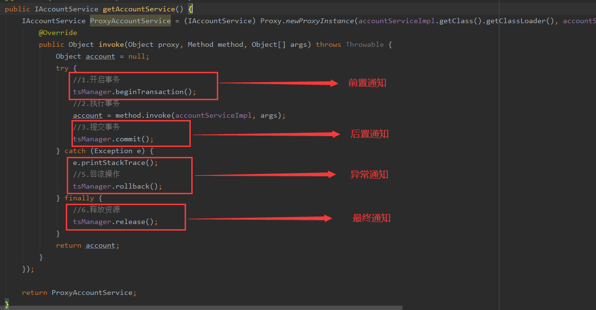

spring_aop_2_new

AOP术语：

 1. Joinpoint连接点

    ​	指的是那些被拦截的方法，（个人理解是：动态代理类的那些接口中的所有方法，newProxyInstance的参数，getInterfaces()）

 2. Pointcut切入点

    ​	指的是那些被增强的方法，比如在动态代理匿名内部类中if("findAll".equals(method.getName())) {return method.invoke(...,args)};

    ​	这样的话就等于findAll是连接点但不是切入点，它并没有被增强。

	3. 通知

    ​	有几种通知类型：前置通知，后置通知，异常通知，最终通知，环绕通知。

    整个invoke方法就是环绕通知，其中有明确的切入点方法调用：method.invoke()

     


spring_aop_2有问题


`bean.xml`

`aop:before 前置通知`

```xml
<?xml version="1.0" encoding="UTF-8"?>
<beans xmlns:xsi="http://www.w3.org/2001/XMLSchema-instance"
       xmlns:context="http://www.springframework.org/schema/context"
       xmlns:p="http://www.springframework.org/schema/p"
       xmlns:util="http://www.springframework.org/schema/util"
       xmlns="http://www.springframework.org/schema/beans" xmlns:aop="http://www.springframework.org/schema/aop"
       xsi:schemaLocation="http://www.springframework.org/schema/beans http://www.springframework.org/schema/beans/spring-beans.xsd http://www.springframework.org/schema/context http://www.springframework.org/schema/context/spring-context.xsd http://www.springframework.org/schema/aop http://www.springframework.org/schema/aop/spring-aop.xsd">

<!--使用aop:config标签表明开始AOP的配置
    使用aop:aspect标签表明配置切面
        id：给切面提供唯一的标识
        ref：指定通知类的bean的id
    aop:aspect标签内部，使用不同的标签来配置不同的通知类型
        aop:before 前置通知
        pointcut 指定切入点表达式，指的是对业务层中哪些方法增强
            切入点表达式写法：
                访问修饰符 返回值类型 包名.包名...类名.方法名(参数列表)
                标准的表达式写法：public void van.service.impl.AccountServiceImpl.saveAccount()
					1. 访问修饰符可以省略
                    2. 返回值可以使用通配符，表示任意返回值
                    3. 包名可以使用通配符表示任意包，但是有几个包就需要几个*
                    4. 类名和方法名都可以使用*来代替
                    注意点：这几种情况都是方法没有传入参数
                    5. 参数列表
                        可以直接写数据类型：
                            基本类型直接写名称 int
                            引用类型写全限定类名 java.lang.String
						使用通配符*表示任意参数类型
                        使用..表示任意参数类型，任意参数个数都可以
                    正常这样用：
                        比如让业务层的所有方法执行前都执行这个方法：pointcut="execution(* van.service.*.*(..))"
-->
    <bean id="accountServiceImpl" class="van.service.impl.AccountServiceImpl"></bean>

    <bean id="logger" class="van.utils.Logger"></bean>

    <aop:config>
        <aop:aspect id="logAdvice" ref="logger">
            <!--aop:before 配置前置通知-->
            <aop:before method="printLog" pointcut="execution(public void van.service.impl.AccountServiceImpl.saveAccount())"></aop:before>
        </aop:aspect>
    </aop:config>
</beans>
```


疑问：试了一下，把pointcut的值设置为自身的ref所在类的方法，这样是不会执行的。


其它通知类型

```xml
<bean id="accountServiceImpl" class="van.service.impl.AccountServiceImpl"></bean>

<bean id="logger" class="van.utils.Logger"></bean>

<aop:config>
    <aop:aspect id="logAdvice" ref="logger">
        <!--aop:before 配置前置通知-->
        <aop:before method="beforePrintLog" pointcut="execution(* van.service.impl.*.*(..))"></aop:before>

        <!--配置后置通知-->
        <aop:after-returning method="afterReturningPrintLog" pointcut="execution(* van.service.impl.*.*(..))"></aop:after-returning>

        <!--配置异常通知-->
        <aop:after-throwing method="afterThrowingPrintLog" pointcut="execution(* van.service.impl.*.*(..))"></aop:after-throwing>

        <!--配置最终通知-->
        <aop:after method="afterPrintLog" pointcut="execution(* van.service.impl.*.*(..))"></aop:after>
    </aop:aspect>
</aop:config>
```

测试类执行结果

```bash
如果正常执行，没有异常出现：
    Logger类中前置通知，进行打印日志
    保存账户
    Logger类中后置通知，进行打印日志
	Logger类中最终通知，进行打印日志
如果出现异常：
	Logger类中前置通知，进行打印日志
    保存账户
    Logger类中异常通知，进行打印日志
    Logger类中最终通知，进行打印日志
也就是说，如果程序出现异常，是不会执行后置通知的
```

- 前置通知：在切入点方法之前执行
- 后置通知：在切入点方法正常执行之后执行
- 异常通知：在切入点方法中产生异常时执行
- 最终通知：无论切入点方法是否正常执行，都会在其结束后执行

后置通知和异常通知只能执行一个


> 上面的xml中pointcut很多重复，下面解决这种重复代码的问题

```xml
使用<aop:pointcut>来配置，其它来引用的时候使用pointcut-ref引用id就行

<aop:config>
    <aop:aspect id="logAdvice" ref="logger">
        <!--aop:before 配置前置通知-->
        <aop:before method="beforePrintLog" pointcut-ref="pointcut1"></aop:before>

        <!--配置后置通知-->
        <aop:after-returning method="afterReturningPrintLog" pointcut-ref="pointcut1"></aop:after-returning>

        <!--配置异常通知-->
        <aop:after-throwing method="afterThrowingPrintLog" pointcut-ref="pointcut1"></aop:after-throwing>

        <!--配置最终通知-->
        <aop:after method="afterPrintLog" pointcut-ref="pointcut1"></aop:after>

        <aop:pointcut id="pointcut1" expression="execution(* van.service.impl.*.*(..))"/>
    </aop:aspect>
</aop:config>
```

当aop:pointcut写在aspect标签内部，那么只能在aspect内部访问

也可以写在config里面aspect外面，这样作用范围广，但是写在aspect外面的时候必须写在最前面，因为里面的内容要用到它，所以得先定义。


> 环绕通知

```xml
<aop:config>
    <aop:pointcut id="pointcut1" expression="execution(* van.service.impl.*.*(..))"/>
    <aop:aspect id="logAdvice" ref="logger">
        <aop:around method="aroundPrintLog" pointcut-ref="pointcut1"></aop:around>
    </aop:aspect>
</aop:config>
```


```java
Logger类中
public void aroundPrintLog() {
    System.out.println("环绕通知打印日志");
}
```


```java
AccountServiceImpl类中
@Override
public void saveAccount() {
    System.out.println("保存账户");
}
```


```java
Test类中：

ApplicationContext ac = new ClassPathXmlApplicationContext("bean.xml");
IAccountService accountServiceImpl = ac.getBean("accountServiceImpl", IAccountService.class);
accountServiceImpl.saveAccount();
```

对Test执行会发现，只输出了aroundPrintLog方法，本身的saveAccount方法并没有执行。

说是因为这里没有明确的切入点方法调用。为此Spring提供了一个接口：ProceedingJoinPoint

```java
/**
* 环绕通知
*/
public Object aroundPrintLog(ProceedingJoinPoint pjp) {
    Object returnValue = null;
    try {
        //在这代码就是前置通知

        Object[] args = pjp.getArgs();

        //这个方法是明确调用切入点方法
        returnValue = pjp.proceed(args);

        //写在这里就是后置通知

        return returnValue;
    } catch (Throwable t) {
        //写在这里是异常通知
        throw new RuntimeException(t);
    } finally {
        //写在这里是最终通知
    }
}
```

实质上环绕通知就是spring为我们提供的，使增强代码可以在何处运行。

