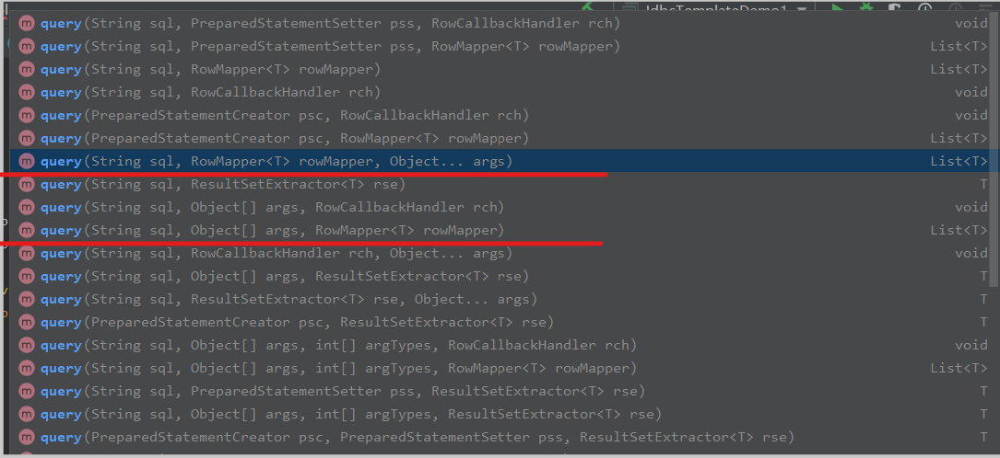

# Spring和JDBCTemplate

## 前言

1. 导入依赖

   导入依赖的时候，每个版本都应该对应，各个版本之间并不兼容

2. 驱动设置

   之前都是com.mysql.jdbc.Driver，现在加一个cj变为com.mysql.cj.jdbc.Driver

3. url设置

   有时候会报时区错误和乱码，可以在url后面添加，？serverTimezone=GMT表示设置时区，&useSSL=false设置不被ssl验证而没有警告。乱码等遇到的时候再看。在xml配置中的时候&不能直接写出来，可以使用转义。

   ```bash
   &amp;表示&
   ```

## 代码实现

1. JdbcTemplate的query方法，有好多种重载类型，这里说常见的一种，传入三个参数（query方法通常用来执行select语句，其它语句用update）

   1. sql语句

   2. RowMapper接口的实现类

   3. 要传入的参数

   4. 如下：两个画出来的方法差不多，只是一个传入的是多维变量，一个是数组（多维变量在几版本后支持的，数组是为了兼容）

      

2. 上面的第二个参数，RowMapper接口的实现类

   1. 必须重写mapRow方法

      mapRow方法是返回每个被封装好的数据集，由spring将这些数据集加入到list中，最后由spring将list返回（返回给query方法的返回值）

      ```java
      List<Account> accounts = jt.query("select * from account where id = ?", new RowMapper<Account>() {
          @Override
          public Account mapRow(ResultSet resultSet, int i) throws SQLException {
              Account account = new Account();
              account.setId(resultSet.getInt("id"));
              account.setName(resultSet.getString("name"));
              account.setMoney(resultSet.getFloat("money"));
              return account;
          }
      }, id);
      ```

3. spring有自带的RowMapper实现类，我们可以直接使用

   BeanPropertyRowMapper，只需要传入需要序列化的类型即可。

   ```java
   List<Account> accounts = jt.query("select * from account where id = ?", new BeanPropertyRowMapper<>(Account.class), id);
   ```

4. 针对重复代码块，可以另外新建一个类，让其他实现类都继承自这个类。并在这个类中定义get方法来返回重复代码块需要执行的结果。

   ```java
   public class JdbcDaoSupport {
       private JdbcTemplate jt;
       public JdbcTemplate getJdbcTemplate() {
           return jt;
       }
   
       public void setDataSource(DataSource dataSource) {
           if(jt == null) {
               jt = new JdbcTemplate(dataSource);
           }
       }
   }
   ```

   ```xml
   <bean id="accountDao" class="dao.impl.AccountDaoImpl">
       <property name="dataSource" ref="driverManagerDataSource"></property>
   </bean>
   ```

5. 对于第四点的重复代码块，spring中有定义JdbcDaoSupport类，可以不自己写

   JdbcDaoSupport源码

   ```java
   package org.springframework.jdbc.core.support;
   public abstract class JdbcDaoSupport extends DaoSupport {
       @Nullable
       private JdbcTemplate jdbcTemplate;
   
       public JdbcDaoSupport() {
       }
   
       /**
        *设置datasource的时候，如果当前jdbctemplate为空，异或当前datasource和传入的不一样
        *都会重新创建一个jdbctemplate，并传入输入的datasource
        */
       public final void setDataSource(DataSource dataSource) {
           if (this.jdbcTemplate == null || dataSource != this.jdbcTemplate.getDataSource()) {
               this.jdbcTemplate = this.createJdbcTemplate(dataSource);
               this.initTemplateConfig();
           }
       }
   
       protected JdbcTemplate createJdbcTemplate(DataSource dataSource) {
           return new JdbcTemplate(dataSource);
       }
   
       @Nullable
       public final DataSource getDataSource() {
           return this.jdbcTemplate != null ? this.jdbcTemplate.getDataSource() : null;
       }
   
       public final void setJdbcTemplate(@Nullable JdbcTemplate jdbcTemplate) {
           this.jdbcTemplate = jdbcTemplate;
           this.initTemplateConfig();
       }
   
       @Nullable
       public final JdbcTemplate getJdbcTemplate() {
           return this.jdbcTemplate;
       }
   
       protected void initTemplateConfig() {
       }
   
       protected void checkDaoConfig() {
           if (this.jdbcTemplate == null) {
               throw new IllegalArgumentException("'dataSource' or 'jdbcTemplate' is required");
           }
       }
   
       protected final SQLExceptionTranslator getExceptionTranslator() {
           JdbcTemplate jdbcTemplate = this.getJdbcTemplate();
           Assert.state(jdbcTemplate != null, "No JdbcTemplate set");
           return jdbcTemplate.getExceptionTranslator();
       }
   
       protected final Connection getConnection() throws CannotGetJdbcConnectionException {
           DataSource dataSource = this.getDataSource();
           Assert.state(dataSource != null, "No DataSource set");
           return DataSourceUtils.getConnection(dataSource);
       }
   
       protected final void releaseConnection(Connection con) {
           DataSourceUtils.releaseConnection(con, this.getDataSource());
       }
   }
   ```

   `使用spring自带的JdbcDaoSupport就难以注解注入jdbctemplate和datasource了，都是用xml的set方法注入`

   `如果想用注解注入，可以使用自己写的JdbcDaoSupport`

   

