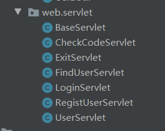

> 一个方法对应一个servlet，在方法很多的情况下，是不建议的，这个时候就需要提取servlet

写一个BaseServlet来继承HttpServlet，并重写他的service方法，因为每次请求都会执行service方法。在service方法中，获取请求路径来获取请求的方法名称，并利用反射来调用这个方法。

每次使用的时候，都将方法定义在UserServlet中就好。

如下目录结构：

只需要BaseServlet和UserServlet，checkCodeServlet即可，其它都可以删除。

 


> 这个BaseServlet也可以进行子类的共有操作，比如序列化json，并返回给客户端


> BaseServlet

```java

public class BaseServlet extends HttpServlet {
    @Override
    protected void service(HttpServletRequest req, HttpServletResponse resp) throws ServletException, IOException {
        //1.获取请求路径
        String uri = req.getRequestURI();
        String methodName = uri.substring(uri.lastIndexOf('/') + 1);

        //这里的this是UserServlet对象
        try {
            Method method = this.getClass().getMethod(methodName, HttpServletRequest.class, HttpServletResponse.class);
            //2.执行方法
            method.invoke(this,req,resp);
        } catch (NoSuchMethodException e) {
            e.printStackTrace();
        } catch (IllegalAccessException e) {
            e.printStackTrace();
        } catch (InvocationTargetException e) {
            e.printStackTrace();
        }
    }
}
```


> UserServlet

```java

@WebServlet("/user/*")
public class UserServlet extends BaseServlet {
    public void login(HttpServletRequest req, HttpServletResponse resp) throws IOException {
        //1.获取用户名和密码
        Map<String,String[]> map = req.getParameterMap();
        //2.封装user对象
        User user = new User();
        try {
            BeanUtils.populate(user,map);
        } catch (IllegalAccessException e) {
            e.printStackTrace();
        } catch (InvocationTargetException e) {
            e.printStackTrace();
        }
        //3.调用service查询
        UserService service = new UserServiceImpl();
        User u = service.login(user);
        //4.判断用户名和密码是否正确
        ResultInfo info = new ResultInfo();
        if(u==null) {
            //用户名或密码错误
            info.setFlag(false);
            info.setErrorMsg("用户名或密码错误");
        }
        //登录成功
        if(u!=null) {
            info.setFlag(true);
        }
        req.getSession().setAttribute("user",u);
        //响应数据
        ObjectMapper mapper = new ObjectMapper();
        resp.setContentType("application/json;charset=utf-8");
        mapper.writeValue(resp.getOutputStream(),info);
    }
    public void regist(HttpServletRequest req, HttpServletResponse resp) throws IOException {
        //验证码校验
        String check = req.getParameter("check");
        //从session中获取验证码
        HttpSession session = req.getSession();
        String checkcode_server = (String) session.getAttribute("CHECKCODE_SERVER");
        //保证验证码只用一次
        session.removeAttribute("CHECKCODE_SERVER");

        if(checkcode_server==null || !checkcode_server.equalsIgnoreCase(check)) {
            //验证码错误
            ResultInfo info = new ResultInfo();
            info.setFlag(false);
            info.setErrorMsg("验证码错误");

            //将info对象序列化
            ObjectMapper mapper = new ObjectMapper();
            String json = mapper.writeValueAsString(info);
            //将json数据写回客户端
            //设置contentType
            resp.setContentType("application/json;charset=utf-8");
            resp.getWriter().write(json);
            return;
        }


        //1.获取数据
        Map<String, String[]> map = req.getParameterMap();
        //2.封装对象
        User user = new User();
        try {
            BeanUtils.populate(user,map);
        } catch (IllegalAccessException e) {
            e.printStackTrace();
        } catch (InvocationTargetException e) {
            e.printStackTrace();
        }
        //3.调用service完成注册
        UserService service = new UserServiceImpl();
        boolean flag = service.regist(user);
        //4.响应结果
        ResultInfo info = new ResultInfo();
        if(flag) {
            //注册成功
            info.setFlag(true);

        } else {
            //注册失败
            info.setFlag(false);
            info.setErrorMsg("注册失败");
        }
        //将info对象序列化
        ObjectMapper mapper = new ObjectMapper();
        String json = mapper.writeValueAsString(info);

        //将json数据写回客户端
        //设置contentType
        resp.setContentType("application/json;charset=utf-8");
        resp.getWriter().write(json);
    }
    public void exit(HttpServletRequest req, HttpServletResponse resp) throws IOException {
        //1.销毁session
        req.getSession().invalidate();
        //2.跳转登录页面
        resp.sendRedirect(req.getContextPath()+"/login.html");
    }
    public void findUser(HttpServletRequest req, HttpServletResponse resp) throws IOException {
        //从session中获取登录用户
        Object user = req.getSession().getAttribute("user");
        //将user写回客户端
        ObjectMapper mapper = new ObjectMapper();
        resp.setContentType("application/json;charset=utf-8");
        mapper.writeValue(resp.getOutputStream(),user);
    }
}
```


